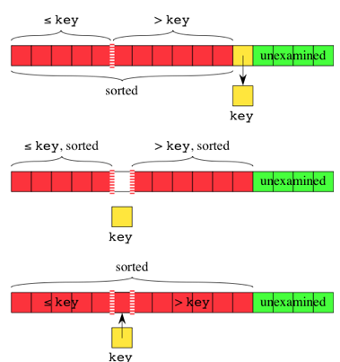

# Ordenamiento por inserción (insertion sort)

Existen muchas maneras distintas de ordenar. Conforme se ejecuta el ordenamiento por selección, el subarreglo al inicio del arreglo queda ordenado mientras que el subarreglo al final aún no lo está. El ordenamiento por selección busca en el subarreglo no ordenado el siguiente elemento que será incluido en el subarreglo ordenado.


En términos de arreglos, imagina que el subarreglo con índices del 0 al 555 ya está ordenado, y queremos insertar el elemento que por ahora está en el índice 6 en este subarreglo ordenado, de manera que el subarreglo con los índices del 0 al 6 esté ordenado. Aquí está cómo empezamos:

        [2,3,7,8,10,13, 5 ]

Y aquí está cómo se debe ver el subarreglo cuando hayamos terminado:

        [2,3,5,7,8,10,13]


Para insertar el elemento que está en la posición 6 en el subarreglo a su izquierda, lo comparamos repetidamente con los elementos a su izquierda, moviéndonos de derecha a izquierda.




## Pseudocodigo

Ahora que sabes cómo insertar un valor en un subarreglo ordenado, puedes implementar el ordenamiento por inserción:
1. Llama insert para insertar el elemento que comienza en el índice 1 en el índice 0 del subarreglo ordenado.
2. Llama insert para insertar el elemento que comienza en el índice 2 en los índices del 0 al 1 del subarreglo ordenado .
3. Llama insert para insertar el elemento que comienza en el índice 3 en los índices del 0 al 2 del subarreglo ordenado .
4. …
5. Por último, llama insert para insertar el elemento que comienza en el índice n-1, minus, 1 en los índices del 0 al n-2, minus, 2 del subarreglo ordenado.

```javascript
var insert = function(array, rightIndex, value) {
    for(var j = rightIndex;
        j >= 0 && array[j] > value;
        j--) {
        array[j + 1] = array[j];
    }   
    array[j + 1] = value; 
};

var insertionSort = function(array) {
    for(var  i= 1; i<array.length; i++ ) {
        console.log("Iteration :"+ i +" array: " + array)
        insert(array,i-1,array[i]);
    }
};

var array = [22, 11, 99, 88, 9, 7, 42];
console.log("Array Before sorting:  " + array);
insertionSort(array);
console.log("Array after sorting:  " + array);
```

```python
def insertion_sort(arr, simulation=False):
    """ Insertion Sort
        Complexity: O(n^2)
    """
    
    iteration = 0
    if simulation:
        print("iteration",iteration,":",*arr)
        
    for i in range(len(arr)):
        cursor = arr[i]
        pos = i
        
        while pos > 0 and arr[pos - 1] > cursor:
            # Swap the number down the list
            arr[pos] = arr[pos - 1]
            pos = pos - 1
        # Break and do the final swap
        arr[pos] = cursor
        
        if simulation:
                iteration = iteration + 1
                print("iteration",iteration,":",*arr)

    return arr

if __name__ == "__main__":
    arr = [22, 11, 99, 88, 9, 7, 42]
    insertion_sort(arr,True)
```